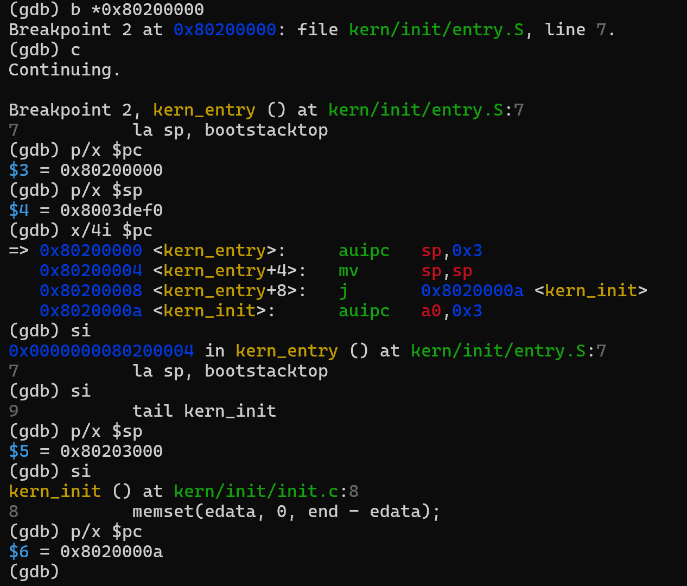

# 操作系统实验报告

## 实验基本信息

| 项目       | 内容                                 |
| -------- | ---------------------------------- |
| **实验名称** | Lab 1：比麻雀更小的麻雀（最小可执行内核）            |
| **小组成员** | 2414132-国轩、2411963-孟子玉、2411185-韩东儒 |
| **完成日期** | 待最终确认 |

### 小组分工

| 成员          | 实验任务                         | 报告任务                |
| ----------- | ---------------------------- | ------------------- |
| 2414132-国轩  | 梳理启动流程，完成练习 1，统筹实验与结果核对      | 实验目的、整体逻辑、练习 1、全文整合 |
| 2411963-孟子玉 | 完成练习 2，使用 GDB 观察复位至内核入口的执行过程 | 练习 2 及调试记录          |
| 2411185-韩东儒 | 核对编译环境，运行 QEMU 并整理测试结果       | 实验环境、测试与验证、实验总结     |

-----

## 一、实验目的

1.  理解 RISC-V 最小可执行内核从复位、固件启动到执行内核入口的过程。
2.  理解链接脚本如何确定内核的内存布局和入口地址，以及交叉编译如何生成 ELF 文件和内核镜像。
3.  理解内核入口设置栈、初始化运行环境的作用，并认识通过 OpenSBI 服务实现格式化输出的调用链。
4.  掌握使用 QEMU 运行内核、使用 GDB 观察启动过程的基本方法。

-----

## 二、实验环境

实际验证所用环境为 Ubuntu 22.04.5 LTS（WSL2，`x86_64`）、`riscv64-unknown-elf-gcc` 15.1.0、QEMU 7.0.0、OpenSBI 1.0 和 RISC-V GDB 16.3.90。实验使用 `lab1` 源码目录中的 Makefile、链接脚本和内核代码。

| 成员          | AI 编程工具            | 底层模型              | 备注                                |
| ----------- | ------------------ | ----------------- | --------------------------------- |
| 2414132-国轩  | Codex（VS Code插件）   | GPT-6             | 用于阅读代码、核对启动参数和辅助整理实验记录            |
| 2411963-孟子玉 |  |  |  |
| 2411185-韩东儒 |  |  |  |

-----

## 三、实验整体逻辑分析

### 3.1 本章节的逻辑主线

这次实验主要想弄清楚：一个最小内核是怎样启动并打印出第一行信息的。虽然它还没有进程、文件系统等功能，但启动前仍要确定镜像放在哪里、CPU 从哪里进入内核，以及内核如何输出文字。

我们观察到的启动顺序是：CPU 从 `0x1000` 的复位代码开始，进入 `0x80000000` 处的 OpenSBI，再到 `0x80200000` 处的内核入口。入口代码先设置内核栈，然后跳到 `kern_init`；`kern_init` 处理未初始化数据区、打印信息，最后进入死循环。当前使用的 `-kernel` 参数会让 QEMU 在启动前放好内核镜像，OpenSBI 再把控制权交给内核。

### 3.2 启动过程中的各个环节

1.  **确定镜像的地址。** `tools/kernel.ld` 把内核基址设为 `0x80200000`，入口设为 `kern_entry`，并安排代码段和数据段的位置。交叉编译、链接后得到 `bin/kernel`，再用 `objcopy` 转成 `bin/ucore.img`。镜像的加载地址必须与链接时使用的地址对应。
2.  **准备运行 C 代码。** `kern/init/entry.S` 中的 `kern_entry` 先把 `sp` 设为 `bootstacktop`，再跳到 `kern_init`。先有可用的栈，C 函数才能正常调用。
3.  **运行最小内核。** `kern_init` 对 `edata` 到 `end` 的区域调用 `memset`，再通过 `cprintf` 输出启动信息，最后进入死循环。能看到这行输出，就说明程序已经运行到了内核代码。
4.  **弄清文字如何输出。** `cprintf` 把字符串格式化后，经 `cons_putc`、`sbi_console_putchar`，最终用 `ecall` 请求 OpenSBI 输出字符。我们用 `make qemu` 检查输出，用 GDB 检查启动途中经过的地址。

Lab1 已给出最小内核的主要代码，本阶段先梳理了启动逻辑与入口操作。

-----

## 四、实验内容与实现

### 练习 1：理解内核启动中的程序入口操作

**负责人：** 2414132-国轩

`kern/init/entry.S` 的 `kern_entry` 是内核在 `0x80200000` 处执行的入口。`bootstack` 预留大小为 `KSTACKSIZE` 的栈空间，`bootstacktop` 标记栈顶。本实验中栈大小为 8 KiB，栈向低地址增长。

  - `la sp, bootstacktop` 把 `bootstacktop` 的地址放进栈指针 `sp`，让内核用上自己的栈。GDB 单步执行后，`sp` 从 `0x8003def0` 变成了 `0x80203000`。
  - `tail kern_init` 跳转到 C 函数 `kern_init`，接下来由 C 代码完成初始化。这里不需要再返回入口汇编；`kern_init` 打印信息后就会一直循环。GDB 中看到跳转后的 PC 为 `0x8020000a`。

**入口调试记录：**

-----

